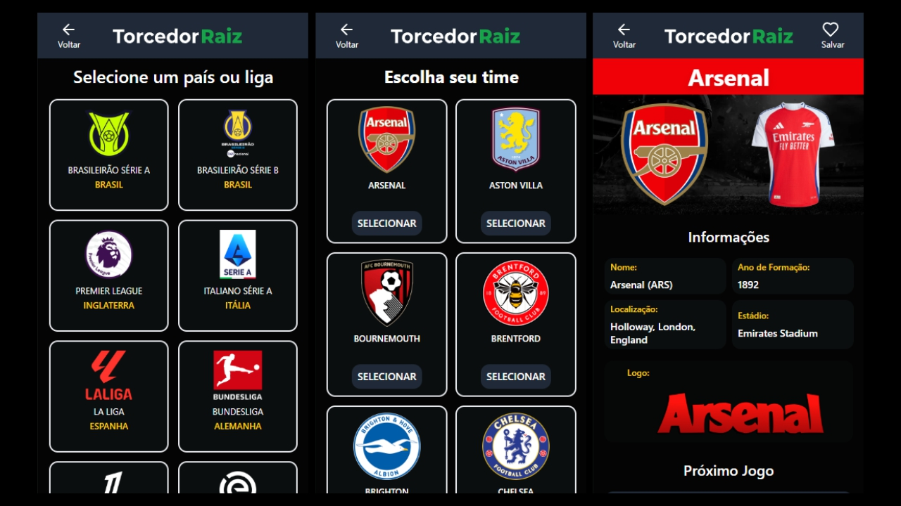
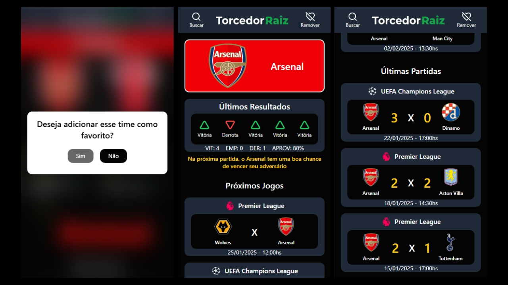
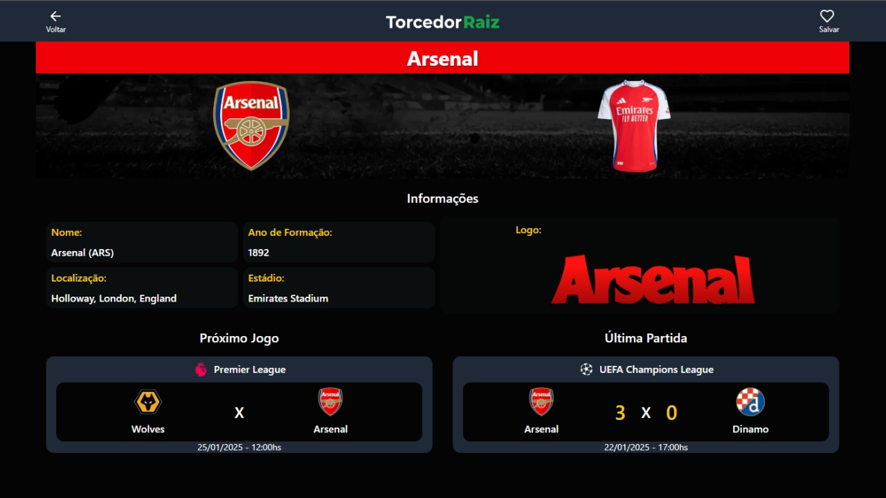
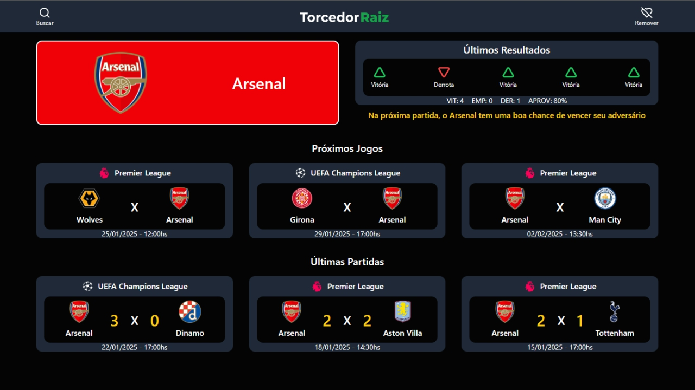

# Torcedor Raiz

Logo: 

## Sobre o projeto

O <strong>Torcedor Raiz</strong> é o aplicativo perfeito para os fãs de futebol que querem ficar por dentro de tudo sobre o seu time do coração. Com o Torcedor Raiz, você pode:

<strong>Selecionar o seu time favorito:</strong> Escolha o seu time do coração e receba todas as informações em um só lugar. 
<strong>Ver as principais estatísticas do time:</strong> Acompanhe os números do seu time, como jogos, vitórias, derrotas, gols marcados e sofridos.
 
<strong>Confira os jogos recentes e próximos:</strong> Fique por dentro dos últimos jogos do seu time e saiba quando serão os próximos.
 
<strong>Tente prever o próximo resultado do time:</strong> Com base nas partidas anteriores, o Torcedor Raiz tenta prever o resultado do próximo jogo do seu time.

## Tecnologias Utilizadas

<a href="https://vite.dev/"><strong>Vite + React:</strong></a> Uma ferramenta de construção de projetos de frontend que se destina a oferecer uma experiência de desenvolvimento mais rápida e leve para projetos de web modernos.

<a href="https://reactrouter.com/"><strong>React Router:</strong></a> Uma biblioteca do React que permite a navegação entre páginas de um aplicativo. Ele é usado para gerenciar rotas e manter a interface do usuário sincronizada com a URL.

<a href="https://tailwindcss.com/"><strong>TailwindCSS:</strong></a> Um framework de estilo CSS (Cascading Style Sheets) que permite estilizar páginas web diretamente na marcação HTML.

<a href="https://www.radix-ui.com/"><strong>Radix-Ui:</strong></a> Uma biblioteca de componentes de código aberto otimizada para desenvolvimento rápido, fácil manutenção e acessibilidade.

APIs utilizadas para a consulta de dados: <a href="https://www.thesportsdb.com/"><strong>TheSportsDB</strong></a> e <a href="https://www.sofascore.com/"><strong>Sofascore</strong></a>.

Persistência de dados utilizando o LocalStorage

## Demonstração

https://torcedor-raiz.vercel.app/

## Screenshots

